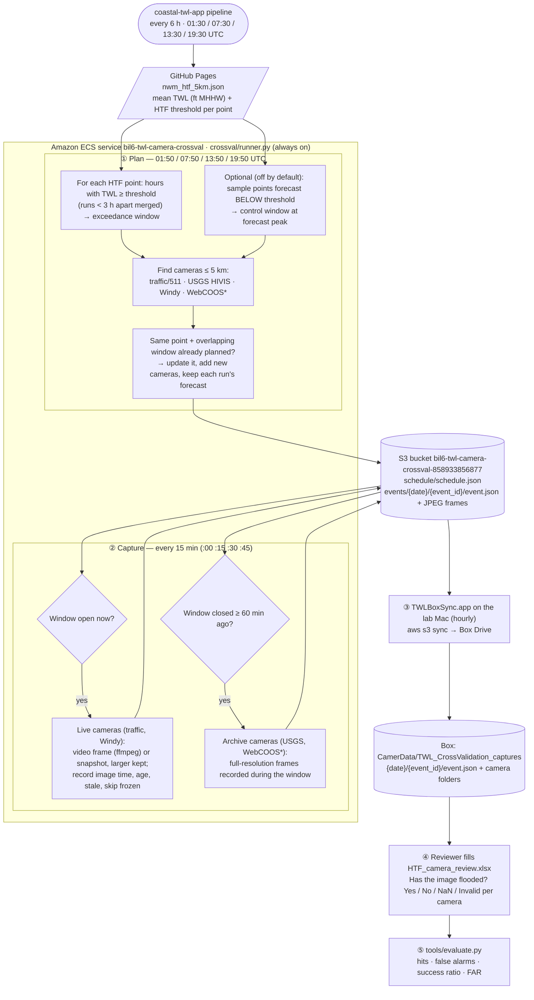

# TWL Camera Cross-Validation

This repo automatically collects **camera evidence for every high tide flooding (HTF) forecast** made by the [Coastal HTF Forecast](https://github.com/Ehsankahrizi/coastal-twl-app) pipeline and iOS app. The images can then be used to check whether the forecasts were right.

- **Exceedance events:** whenever the app forecasts that the total water level (TWL) at an HTF point will reach its threshold, this repo finds cameras within **5 km** of that point. It records frames from them during the forecast window.
- **Control events (off by default):** a sample of points forecast to stay **below** their threshold can be recorded the same way (`CONTROL_MAX_PER_RUN`, e.g. `15`). Controls are what reveal *missed* floods. With them off, the evaluation measures hits and false alarms only.

A reviewer marks each camera's frames in an Excel workbook (Yes / No / NaN / Invalid), and `tools/evaluate.py` turns the answers into forecast skill scores.

The pipeline runs as an always-on container on **Amazon ECS (Fargate)** in the University of Alabama BIL6 AWS account. Frames and metadata are stored in **S3** and copied hourly into **Box** by a small app on the lab Mac.

---

## Workflow



\* WebCOOS runs only if a WebCOOS token is provided (see [Credentials](#credentials)).

**Why live and archive differ:**
- **Live cameras:** traffic cameras and Windy webcams keep no history, so their frames must be grabbed *during* the window.
- **Archive cameras:** USGS (and WebCOOS) keep every image, so their frames are downloaded *after* the window. The frames then cover exactly the forecast period.

---

## Output

Each event gets one folder, with the same layout in S3 (`s3://bil6-twl-camera-crossval-858933856877/events/`) and in Box:

```
2026-09-24/
  20260924T22Z_HTF1071_exceedance/
    event.json
    traffic_VA-cam-2853/
      2026-09-24T21-30Z.jpg
      2026-09-24T21-45Z.jpg
      …
      map.png
    usgs_NJ_Inside_Thorofare_at_Atlantic_City/
      2026-09-24T22-00Z.jpg
      map.png
```

Each camera folder also has **`map.png`**, a two-panel figure that is redrawn every time the camera saves a frame.

**Left panel: zoomed street map**
- the HTF point (ID, coordinates, threshold);
- the 5 km search radius;
- the camera;
- a line with the distance from the HTF point to the camera;
- a legend, scale bar and north arrow.

**Right panel: forecast time series, like the iOS app**
- the mean NWM TWL forecast for the HTF point (ft above MHHW), with earlier forecast runs shown faintly;
- the HTF threshold, and the part of the forecast above it shaded red;
- the HTF period highlighted;
- a green marker at every time this camera captured an image. Times are labeled individually when there is room; otherwise a summary box gives the count and time span.

To draw or redraw maps for existing folders, run `python3 -m crossval.maps --events "$BOX" --force`.

**Event ID:** `<window start, UTC hour>_HTF<point id>_<exceedance|control>`

**File names:** image names are the capture time in UTC (`YYYY-MM-DDTHH-MMZ`).

### `event.json`

| Field | Meaning | Unit |
|---|---|---|
| `kind` | `exceedance` (flooding forecast) or `control` (forecast below threshold) | — |
| `htf_id`, `lat`, `lon`, `time_zone` | HTF point | decimal degrees; IANA zone |
| `threshold_ft_mhhw` / `threshold_m_mhhw` | HTF mid threshold | **ft** / **m** above **MHHW** |
| `htf_range_m` | HTF threshold range from the source data | **m** above MHHW |
| `window.*_local` | The same window bounds in the point's local time, e.g. `2026-09-24T19:00:00-04:00` | local |
| `window.start`, `window.end` | First / last forecast hour at or above the threshold (controls: forecast peak) | UTC |
| `window.capture_start`, `capture_end` | Window padded by 30 min (controls: ±60 min around the peak) | UTC |
| `forecasts[]` | One entry per forecast run that predicted this event: `peak_ft_mhhw`, `peak_time`, `hours_at_or_above`, `margin_ft` (peak − threshold), full `series_ft_mhhw` | **ft MHHW**, UTC |
| `nwm_stations[]` | NWM stations averaged for the forecast | km |
| `cameras[]` | Cameras within 5 km: `source`, `id`, `name`, `distance_km`, `archive`, links | km |
| `captures[]` | Every saved frame (see below) | UTC + local |
| `state` | `live_done`, `backfill_done` | — |

### Frame timing (`captures[]`)

A frame's *fetch* time and the time the camera *took* the image can differ. For example, a frozen traffic camera keeps serving an old picture, and Windy refreshes some webcams only every hour. Both are recorded:

| Field | Meaning |
|---|---|
| `time` / `time_local` | When the frame was fetched (live) or recorded (archive) — UTC / point's local time |
| `image_time` / `image_time_local` | When the camera took the image, if known |
| `image_time_basis` | How `image_time` is known: `live_stream` (frame from live video), `http_last_modified` (agency server header), `windy_last_updated` (Windy API), `usgs_filename`, `webcoos_timestamp`, or `unknown` |
| `age_min` | `time − image_time` in minutes |
| `stale` | `true` if the image was more than 30 min old when fetched. `tools/evaluate.py` skips events whose frames are all stale. |
| `method` | `hls_frame`, `snapshot`, `windy_current`, `usgs_archive`, `webcoos_archive` |
| `sha1` | Image hash; a frame identical to the camera's previous one (frozen camera) is not saved |
| `file`, `artifact`, `size` | Where the JPEG is and its pixel size |

For traffic cameras, both the video frame and the agency snapshot are fetched, and the larger image is kept. USGS archive frames are full resolution.

**Checked on 2026-09-25:**
- **USGS:** file-name times match the time printed on the image (e.g. `23-12Z` ↔ "19:12:11 EDT").
- **Traffic snapshots:** 63 of 68 cameras served images less than 1 minute old.

---

## AWS deployment (Amazon ECS)

### Account rules (BIL6)

- **Tags:** every resource is tagged `Project=BIL6`.
- **Names:** resources start with `bil6-twl-camera-crossval`. IAM roles must be named `bil6-*`.
- **Allowed services:** EC2, VPC, ECS, ECR, Lambda, S3, DynamoDB and CloudWatch. EventBridge Scheduler, Secrets Manager and SSM are **not** available, which is why:
  - the container schedules itself (`crossval/runner.py`) instead of using EventBridge;
  - the Windy key is a private S3 object instead of a secret.
- **Budget:** the billing alarm fires at $200/month. This deployment costs about **$12–15/month**: Fargate 0.25 vCPU / 0.5 GB always on (≈ $9), a public IPv4 address (≈ $3.6), and S3 plus logs (< $1).

### Resources (region `us-east-2`)

| Resource | Name | Notes |
|---|---|---|
| S3 bucket | `bil6-twl-camera-crossval-858933856877` | Private (all public access blocked), SSE-S3 encrypted |
| ECS cluster | `bil6-twl-camera-crossval-cluster` | Fargate |
| ECS service / task definition | `bil6-twl-camera-crossval` | 1 task, 256 CPU / 512 MB, image `ghcr.io/ehsankahrizi/twl_camera_crossvalidation:latest` |
| IAM role (execution) | `bil6-twl-camera-crossval-exec` | `AmazonECSTaskExecutionRolePolicy` (write logs) |
| IAM role (task) | `bil6-twl-camera-crossval-task` | Get/Put/List on this bucket only |
| Security group | `bil6-twl-camera-crossval-sg` | Default VPC; no inbound rules, outbound only |
| Log group | `/ecs/bil6-twl-camera-crossval` | 30-day retention |

The container image is built by `.github/workflows/docker.yml` on every push to `main`. It is published to the **GitHub Container Registry**, so no ECR is needed. The image is public, like the repo, and contains no credentials.

### Setup steps (from scratch)

Run these with the AWS CLI configured for the BIL6 account (`aws configure`, region `us-east-2`).

**1. S3 bucket**

```bash
B=bil6-twl-camera-crossval-858933856877
aws s3api create-bucket --bucket $B --region us-east-2 --create-bucket-configuration LocationConstraint=us-east-2
aws s3api put-public-access-block --bucket $B --public-access-block-configuration BlockPublicAcls=true,IgnorePublicAcls=true,BlockPublicPolicy=true,RestrictPublicBuckets=true
aws s3api put-bucket-encryption --bucket $B --server-side-encryption-configuration '{"Rules":[{"ApplyServerSideEncryptionByDefault":{"SSEAlgorithm":"AES256"}}]}'
aws s3api put-bucket-tagging --bucket $B --tagging 'TagSet=[{Key=Project,Value=BIL6},{Key=Name,Value=bil6-twl-camera-crossval}]'
```

**2. IAM roles**

```bash
TRUST='{"Version":"2012-10-17","Statement":[{"Effect":"Allow","Principal":{"Service":"ecs-tasks.amazonaws.com"},"Action":"sts:AssumeRole"}]}'
aws iam create-role --role-name bil6-twl-camera-crossval-exec --assume-role-policy-document "$TRUST" --tags Key=Project,Value=BIL6
aws iam attach-role-policy --role-name bil6-twl-camera-crossval-exec --policy-arn arn:aws:iam::aws:policy/service-role/AmazonECSTaskExecutionRolePolicy
aws iam create-role --role-name bil6-twl-camera-crossval-task --assume-role-policy-document "$TRUST" --tags Key=Project,Value=BIL6
aws iam put-role-policy --role-name bil6-twl-camera-crossval-task --policy-name bil6-twl-camera-crossval-s3 --policy-document \
  "{\"Version\":\"2012-10-17\",\"Statement\":[{\"Effect\":\"Allow\",\"Action\":[\"s3:GetObject\",\"s3:PutObject\"],\"Resource\":\"arn:aws:s3:::$B/*\"},{\"Effect\":\"Allow\",\"Action\":\"s3:ListBucket\",\"Resource\":\"arn:aws:s3:::$B\"}]}"
```

**3. Logs, security group, cluster**

```bash
aws logs create-log-group --log-group-name /ecs/bil6-twl-camera-crossval --tags Project=BIL6
aws logs put-retention-policy --log-group-name /ecs/bil6-twl-camera-crossval --retention-in-days 30
VPC=$(aws ec2 describe-vpcs --filters Name=isDefault,Values=true --query 'Vpcs[0].VpcId' --output text)
SG=$(aws ec2 create-security-group --group-name bil6-twl-camera-crossval-sg --description "outbound only" --vpc-id $VPC \
  --tag-specifications 'ResourceType=security-group,Tags=[{Key=Project,Value=BIL6},{Key=Name,Value=bil6-twl-camera-crossval-sg}]' --query GroupId --output text)
aws ecs create-cluster --cluster-name bil6-twl-camera-crossval-cluster --capacity-providers FARGATE --tags key=Project,value=BIL6
```

**4. Task definition**

Save as `taskdef.json`, with the account ID filled in:

```json
{
  "family": "bil6-twl-camera-crossval",
  "requiresCompatibilities": ["FARGATE"], "networkMode": "awsvpc", "cpu": "256", "memory": "512",
  "runtimePlatform": {"cpuArchitecture": "X86_64", "operatingSystemFamily": "LINUX"},
  "executionRoleArn": "arn:aws:iam::858933856877:role/bil6-twl-camera-crossval-exec",
  "taskRoleArn": "arn:aws:iam::858933856877:role/bil6-twl-camera-crossval-task",
  "containerDefinitions": [{
    "name": "crossval", "essential": true,
    "image": "ghcr.io/ehsankahrizi/twl_camera_crossvalidation:latest",
    "environment": [
      {"name": "S3_BUCKET", "value": "bil6-twl-camera-crossval-858933856877"},
      {"name": "SAVE_WINDY_IMAGES", "value": "true"},
      {"name": "AWS_DEFAULT_REGION", "value": "us-east-2"}],
    "logConfiguration": {"logDriver": "awslogs", "options": {
      "awslogs-group": "/ecs/bil6-twl-camera-crossval", "awslogs-region": "us-east-2", "awslogs-stream-prefix": "crossval"}}
  }],
  "tags": [{"key": "Project", "value": "BIL6"}]
}
```

```bash
aws ecs register-task-definition --cli-input-json file://taskdef.json
```

**5. Service** (public subnets of the default VPC, public IP so the container can reach the cameras)

```bash
SUBNETS=$(aws ec2 describe-subnets --filters Name=vpc-id,Values=$VPC Name=default-for-az,Values=true --query 'Subnets[].SubnetId' --output text | tr '\t' ',')
aws ecs create-service --cluster bil6-twl-camera-crossval-cluster --service-name bil6-twl-camera-crossval \
  --task-definition bil6-twl-camera-crossval --desired-count 1 --launch-type FARGATE \
  --network-configuration "awsvpcConfiguration={subnets=[$SUBNETS],securityGroups=[$SG],assignPublicIp=ENABLED}" \
  --deployment-configuration "maximumPercent=100,minimumHealthyPercent=0" \
  --propagate-tags SERVICE --enable-ecs-managed-tags --tags key=Project,value=BIL6
```

<a id="credentials"></a>**6. Credentials**

Upload the Windy key yourself. It is typed at a hidden prompt and never shown or written to disk:

```bash
read -rs "K?Windy API key: " && printf '%s' "$K" | aws s3 cp - s3://$B/config/windy_api_key --sse AES256 && unset K
```

In bash, use `read -rsp "Windy API key: " K` instead. The container reads the key when it starts, so restart the service afterwards (see below).

- **WebCOOS (optional):** add `{"name": "WEBCOOS_TOKEN", "value": "…"}` to the task definition's `environment`. Anyone who can read the task definition can see it, so a token dedicated to this project is best.
- **Windy terms:** the Windy Webcams API terms restrict storing webcam images. `SAVE_WINDY_IMAGES=true` records them for this research use. Set it to `false` to keep only the webcam list and links.

### Operating it

| Task | Command |
|---|---|
| Deploy new code | Merge to `main`; wait for **Build container image** to finish; then `aws ecs update-service --cluster bil6-twl-camera-crossval-cluster --service bil6-twl-camera-crossval --force-new-deployment` |
| Watch the logs | `aws logs tail /ecs/bil6-twl-camera-crossval --follow` |
| Check it is running | `aws ecs describe-services --cluster bil6-twl-camera-crossval-cluster --services bil6-twl-camera-crossval --query 'services[0].[runningCount,deployments[0].rolloutState]'` |
| Pause (stop costs) | `aws ecs update-service --cluster bil6-twl-camera-crossval-cluster --service bil6-twl-camera-crossval --desired-count 0` (set back to `1` to resume) |
| Count frames | `aws s3 ls s3://bil6-twl-camera-crossval-858933856877/events/ --recursive --summarize \| tail -2` |

ECS does not pull a new `:latest` by itself; the `--force-new-deployment` step is what picks up new code. After a restart, the container immediately runs one capture cycle, so no window is missed.

### GitHub Actions (fallback)

The original GitHub Actions pipeline is still in the repo:
- `plan.yml` and `capture.yml` store metadata in the repo and frames as run artifacts.
- Both are **disabled**, because GitHub's `*/15` schedule proved unreliable: it skipped about 3 hours on the first night.
- Re-enable them only if ECS is unavailable, and never both at once. The two keep separate state and would capture everything twice.

---

## Box sync (lab Mac)

`~/Developer/TWLBoxSync.app` runs `tools/sync_to_box.py`. The script runs `aws s3 sync s3://bil6-twl-camera-crossval-858933856877/events/` into:

```
~/Library/CloudStorage/Box-Box/Coastal Hydrology Lab/Ehsan's project/CamerData/TWL_CrossValidation_captures
```

A launchd agent (`~/Library/LaunchAgents/com.ehsankahrizi.twl-crossval-sync.plist`) opens the app every hour. Its log is `~/Library/Logs/twl-crossval-sync.log`.

- **Why an app and not a plain script:** macOS lets background jobs write into Box Drive only when they run as an app that has been granted access.
- **If the Mac is off:** frames wait in S3 and are copied at the next run.
- **Run it now:** `open ~/Developer/TWLBoxSync.app`
- **Stop it:** `launchctl bootout gui/$(id -u) ~/Library/LaunchAgents/com.ehsankahrizi.twl-crossval-sync.plist`

---

## Review and evaluate

Review answers live in one Excel workbook in the Box folder, **`HTF_camera_review.xlsx`**. The hourly sync never touches it; it only writes the event folders.

```bash
BOX="$HOME/Library/CloudStorage/Box-Box/Coastal Hydrology Lab/Ehsan's project/CamerData/TWL_CrossValidation_captures"
```

### 1. Create or refresh the workbook

```bash
python3 tools/make_review_sheet.py --events "$BOX"
```

- **Rows:** one per **forecast exceedance event × camera** (`--include-controls` adds control events).
- **Re-runs:** run it again as new events arrive. New rows are added and answers already typed are kept, matched by event and camera. **Close the file in Excel first.**

Each row has:
- the HTF period in local time and UTC;
- the HTF ID and location;
- the camera source, ID, name and distance;
- the number of images, and how many are too old to use;
- links to the camera's image folder and its location map;
- a yellow **Has the image flooded?** cell (drop-down, see below) and optional notes.

The **Instructions** sheet explains what counts as flooded, with an example row. The **Progress** sheet counts answered rows. Whether an event is a forecast exceedance or a control is kept in a hidden column, so the reviewer is not biased.

### 2. Review

The reviewer opens each row's image folder, looks at the photos taken during the HTF period, and picks one answer:

| Answer | Meaning | Scored? |
|---|---|---|
| **Yes** | Flooded: water on a road, sidewalk, parking lot or yard, or over a seawall or dock | ✅ |
| **No** | Not flooded: water stays in its normal channel or beach, or the road is only wet from rain | ✅ |
| **NaN** | Cannot be seen: images missing or broken, night, fog, rain on the lens | excluded |
| **Invalid** | Camera cannot show ground-level flooding, e.g. on a bridge or overpass high above the ground | excluded |

Photos listed under *Old images to ignore* show a time before the HTF period.

### 3. Score

```bash
python3 tools/evaluate.py --events "$BOX" --csv "$BOX/results.csv"
```

Per event:
- **flooded** if **any** camera is Yes;
- **not flooded** if its Yes/No cameras are all No (NaN and Invalid cameras are ignored);
- **skipped** if no camera is Yes or No, or if all its frames are stale.

It reports:
- hits (flooding forecast and seen);
- false alarms (forecast, not seen);
- the success ratio and the false alarm ratio (FAR).

Misses and POD need control events, which are off by default. `results.csv` has one row per scored event with the camera Yes/No counts, the forecast peak and the threshold.

---

## Settings

All tunable values are in `crossval/config.py`:

| Setting | Default |
|---|---|
| Camera radius | 5 km |
| Nearest traffic cameras per event | 5 |
| Window padding | 30 min |
| Live capture interval | 15 min |
| Archive frame spacing | 15 min |
| Stale threshold | 30 min |
| Control events per forecast run | 0 (off; env `CONTROL_MAX_PER_RUN`) |
| Image width | ≤ 1920 px |

## Limitations

- **Traffic cameras:** some states' video streams refuse outside players. For those cameras the agency snapshot is saved (`method: snapshot`). A few agency servers don't report when a snapshot was taken (`image_time_basis: unknown`).
- **Windy:** free-tier images are 400 × 224 px and typically 5–15 minutes old when fetched.
- **Camera coverage:** many HTF points have no camera within 5 km. They are skipped because there is no evidence to collect.
- **Controls:** off by default, so misses (flooding that was not forecast) are not measured, and POD cannot be computed. If they are turned on, control points are chosen nearest to their threshold, which is not a random sample.
