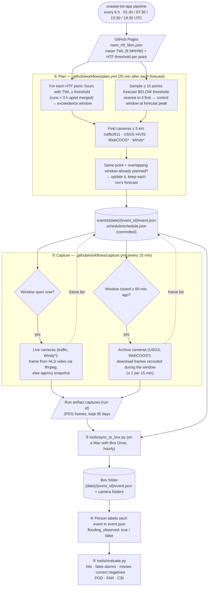

# TWL Camera Cross-Validation

This repo automatically collects **camera evidence for every high tide flooding (HTF) forecast** made by the [Coastal HTF Forecast](https://github.com/Ehsankahrizi/coastal-twl-app) pipeline and iOS app. The images can then be used to check whether the forecasts were right.

- **Exceedance events:** whenever the app forecasts that the total water level (TWL) at an HTF point will reach its threshold, this repo finds cameras within **5 km** of that point. It records frames from them during the forecast window.
- **Control events:** a sample of points forecast to stay **below** their threshold is recorded the same way. Controls are what reveal *missed* floods, not just false alarms.

The collected frames are labeled by a person (flooding seen: yes/no), and `tools/evaluate.py` turns the labels into forecast skill scores.

---

## Workflow



\* WebCOOS runs only if the `WEBCOOS_TOKEN` secret is set. Windy images are saved only if the `SAVE_WINDY_IMAGES` variable is `true` (see [Windy note](#windy)).

**Why live and archive differ:**
- **Live cameras:** traffic cameras and Windy webcams keep no history, so their frames must be grabbed *during* the window.
- **Archive cameras:** USGS (and WebCOOS) keep every image, so their frames are downloaded *after* the window. The frames then cover exactly the forecast period, even if a scheduled run was delayed.

---

## Output

Each event gets one folder, both in `events/` (metadata only) and in Box (metadata plus images):

```
2026-09-24/
  20260924T22Z_HTF1071_exceedance/
    event.json
    traffic_VA-cam-2853/
      2026-09-24T21-30Z.jpg
      2026-09-24T21-45Z.jpg
      …
    usgs_NJ_Inside_Thorofare_at_Atlantic_City/
      2026-09-24T22-00Z.jpg
```

**Event ID:** `<window start, UTC hour>_HTF<point id>_<exceedance|control>`

**File names:** image names are the capture time in UTC.

### `event.json`

| Field | Meaning | Unit |
|---|---|---|
| `kind` | `exceedance` (flooding forecast) or `control` (forecast below threshold) | — |
| `htf_id`, `lat`, `lon`, `time_zone` | HTF point | decimal degrees; IANA zone |
| `threshold_ft_mhhw` / `threshold_m_mhhw` | HTF mid threshold | **ft** / **m** above **MHHW** |
| `htf_range_m` | HTF threshold range from the source data | **m** above MHHW |
| `window.start`, `window.end` | First / last forecast hour at or above the threshold (controls: forecast peak) | UTC |
| `window.capture_start`, `capture_end` | Window padded by 30 min (controls: ±60 min around the peak) | UTC |
| `forecasts[]` | One entry per forecast run that predicted this event: `peak_ft_mhhw`, `peak_time`, `hours_at_or_above`, `margin_ft` (peak − threshold), full `series_ft_mhhw` | **ft MHHW**, UTC |
| `nwm_stations[]` | NWM stations averaged for the forecast | km |
| `cameras[]` | Cameras within 5 km: `source`, `id`, `name`, `distance_km`, `archive`, links | km |
| `captures[]` | Every saved frame: `camera_id`, `time`, `method` (`hls_frame`, `snapshot`, `usgs_archive`, …), `file`, `artifact`, pixel `size` | UTC |
| `state` | `live_done`, `backfill_done` | — |
| `label` | **Filled in by a person:** `flooding_observed` (true/false), `confidence` (high/medium/low), `labeled_by`, `notes` | — |

---

## Setup

### 1. Secrets and variables

Set these under **Settings → Secrets and variables → Actions**:

| Name | Type | Needed for |
|---|---|---|
| `API_WWW_WINDY_COM` | Secret | Listing Windy webcams near each point |
| `WEBCOOS_TOKEN` | Secret (optional) | WebCOOS archive frames |
| `SAVE_WINDY_IMAGES` | Variable (optional) | `true` to save Windy images (see below) |

Keys are read only from these settings and never written to the repo.

<a id="windy"></a>**Windy note:** the Windy Webcams API terms restrict storing webcam images, and image links expire after 10 minutes. By default, Windy webcams near each event are listed in `event.json` with their links and 24-hour player. Their images are not saved. Set `SAVE_WINDY_IMAGES=true` only if your use is permitted.

### 2. Box sync (on the lab Mac)

Frames stay available as workflow artifacts for 90 days. To copy them into Box, run:

```bash
python3 tools/sync_to_box.py --dest "$HOME/Library/CloudStorage/Box-Box/<your Box folder>"
```

The script needs the GitHub CLI (`gh`) logged in. It remembers which artifacts were already copied, so it can run hourly, for example from a launchd agent.

### 3. Label and evaluate

1. Open an event folder in Box and look at the frames.
2. Fill in the `label` block in the event's `event.json` in this repo:

   ```json
   "label": {"flooding_observed": true, "confidence": "high", "labeled_by": "EK", "notes": "water over Shore Dr at 23:15Z"}
   ```

3. Score the forecast:

   ```bash
   python3 tools/evaluate.py --min-confidence medium --csv results.csv
   ```

---

## Settings

All tunable values are in `crossval/config.py`:

| Setting | Default |
|---|---|
| Camera radius | 5 km |
| Nearest traffic cameras per event | 5 |
| Window padding | 30 min |
| Live capture interval | 15 min |
| Archive frame spacing | 15 min |
| Control events per forecast run | 15 |
| Image width | ≤ 1280 px |

## Limitations

- **Scheduling delays:** GitHub's scheduled runs can start 5–15 minutes late, so live frames are about every 15–20 minutes.
- **Traffic cameras:** some states' video streams refuse outside players. For those cameras the agency snapshot is saved instead, recorded as `method: snapshot`.
- **Camera coverage:** many HTF points have no camera within 5 km. They are skipped because there is no evidence to collect.
- **Controls:** control points are chosen nearest to their threshold, which is the most informative for misses but not a random sample. Scores from controls are therefore not coast-wide rates.
